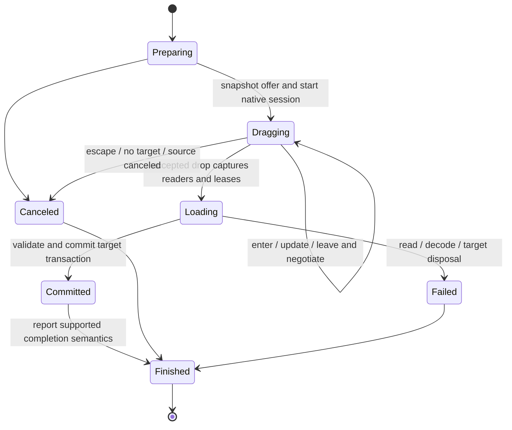

<!-- Copyright © The Daybrite Project; SPDX-License-Identifier: CC-BY-SA-4.0 -->

# Drag and drop for Day apps

Investigation: 2026-09-17. **Implementation in progress.** The eager-byte API and native
adapters for all eight toolkits are implemented. AppKit/GTK/Qt cross-process desktop transfers
have user-reported manual validation; native HTML image/custom-data and rejection tests pass.
UIKit and Android applications build and their page scripts pass. Harmony is compile checked;
Windows still needs its own build/runtime validation. Asynchronous application readers/file
leases, file promises, and the full acceptance matrix below remain outstanding. See the
[current API and verification record](drag-and-drop.md). The vocabulary below describes the
complete intended API, not a claim that every part has landed.
The [typed clipboard API](clipboard.md#typed-binary-content) is implemented. This plan builds on
its representation model, without using the system clipboard as the transport for a drag.

## Recommended scope and boundaries

Deliver incoming image/file drops in Day-Sketch first, then outgoing selection drags and
cross-window transfers, then collection integration and richer file providers. Make the
first API capable of multiple items and asynchronous reads so later stages do not require
replacing it. Support independent applications through standard OS transfer formats; a
second Day process must work without sharing memory or connecting to a Day service.

Keep two interaction mechanisms:

- Direct manipulation: the existing canvas move, resize, rotate, and Option/Alt duplication
  gestures. These change the document and remain available on every platform.
- Data transfer: a native drag session with offers, target negotiation, loading, and a result.
  This can move between views, windows, or applications. A pointer gesture fallback supports
  local transfers where system dragging is unavailable, but must report that limitation.

DnD should be an attachable capability for pieces and native collection hosts. Apps should
not create a second root overlay that intercepts all input or replace native text editing.
Copy/paste, keyboard movement, and file import remain accessible alternatives.

## Existing implementation seams

The source investigation found these reusable paths:

| Area | Current implementation | Consequence |
|---|---|---|
| Specification | `crates/day-spec/src/lib.rs`: `ListReorder`, `TreeMoves`, `Toolkit::attach_list/attach_tree`, `Cap` | Already separates synchronous policy from committed model changes. Generalize the pattern, not the row-index payload. |
| Core and pieces | `crates/day-core`, `crates/day-pieces`: retained nodes, scopes, event dispatch, list/tree sources | Own handler lifetimes and transaction dispatch here; do not expose toolkit handles to apps. |
| AppKit | `toolkits/day-appkit/src/lib.rs`: table and outline dragging pasteboards | Local-source checks deliberately reject foreign drags. General drop targets need separate offered-data handling. |
| UIKit | `toolkits/day-uikit/src/lib.rs`: table drag delegate, empty `NSItemProvider`, move-target delegate | Supports local row reordering, not reusable external image offers. |
| GTK | `toolkits/day-gtk/src/lib.rs`: `DragSource`, row-token provider, drop guards | Reuse controller lifetime patterns; replace row-only payload assumptions. |
| Qt | `toolkits/day-qt-sys/src/shim.cpp`: `DayList`, `QDrag`, guarded `dropEvent` | Current source/target state is a list selection. General adapters require MIME data and session identity. |
| Windows XAML | `toolkits/day-xaml-sys/src/shim.cpp`: `day_xaml_list_enable_reorder`, `day_xaml_cell_drag` | Existing `CanDrag`, `AllowDrop`, `DataPackageOperation` wiring is local row bookkeeping. Add actual data packages. |
| Android MDC | `toolkits/day-android/java/dev/daybrite/day/bridge/DayBridge.java`: `ItemTouchHelper` | Incremental row swaps are not Android system data dragging. Add `View.OnDragListener` separately. |
| web-dom | `crates/day-cli/resources/web/shim.js`: `day_dom_list_reorder` | Pointer capture and a CSS gap implement local reorder; there is no HTML transfer session in that path. |
| Harmony ArkUI | `toolkits/day-arkui-sys/src/shim.cpp`: `NODE_ON_DRAG_START`, `NODE_ON_DROP`, draggable cells | Native drag events exist, but handlers are hard-wired to list state. Route by registered capability before list fallback. |

`Cap::TreeMove` remains unsupported in several adapters; a general drop API must not silently
claim that tree reparenting works everywhere. Preserve the current list/tree contracts while
adding transfer support. See [list](list.md) and [tree](tree.md) for their separate semantics.

## Toolkit investigation and adapter work

### AppKit: macos-appkit

Use `NSView.registerForDraggedTypes`, `NSDraggingDestination` callbacks, and
`beginDraggingSessionWithItems:event:source:` with `NSDraggingItem` and `NSDraggingSource`.
Negotiate an `NSDragOperation` during enter/update; read the dragging pasteboard at drop.
Keep the source/provider alive through session completion. The initiating `NSEvent` cannot
be replaced by a queued synthetic event. Source operation masks distinguish local and
external destinations. [Apple source protocol](https://developer.apple.com/documentation/appkit/nsdraggingsource)

Accept standard encoded image types, file URLs, and `NSFilePromiseReceiver` offers. Finder
normally provides file URLs; other apps can promise files that only materialize after the
drop. Export generated drawings with `NSFilePromiseProvider`, using a destination-supplied
directory and safe suggested filenames. File-promise completion is distinct from pointer
release. [Apple file-promise sample](https://developer.apple.com/documentation/appkit/supporting-table-view-drag-and-drop-through-file-promises)

Implementation: add retained source/destination objects in the AppKit backend, map MIME/UTI
names using shared transfer codecs, and carry scoped file access into asynchronous imports.
Never pass an unretained dragging-info pointer to a Rust future.

### UIKit: ios-uikit

Attach `UIDragInteraction` and `UIDropInteraction` to the canvas host. Use `UIDragItem`
providers, a synchronous `UIDropProposal`, and provider loading from `performDrop`.
Native table/collection views have specialized delegates and should retain those adapters.
`localDragSession` identifies an in-app session; `localContext` is process-local and never
an external serialization format. [UIKit DnD](https://developer.apple.com/documentation/uikit/drag-and-drop),
[local session](https://developer.apple.com/documentation/uikit/uidropsession/localdragsession),
[local context](https://developer.apple.com/documentation/uikit/uidragsession/localcontext)

`NSItemProvider` supports multiple data/file representations, lazy handlers, visibility,
and progress. Prefer encoded PNG/JPEG or file representations to preserve original bytes;
convert image-object-only offers when necessary. Retain/copy temporary files during their
valid access period. Marshal provider callbacks onto Day's UI thread before touching reactive
state. [Item providers](https://developer.apple.com/documentation/foundation/nsitemprovider),
[file representations](https://developer.apple.com/documentation/foundation/nsitemprovider/registerfilerepresentation(for:visibility:openinplace:loadhandler:))

Implementation: use native lift/preview behavior, report actual device/OS interaction support,
and test touch, pointer, split-view transfers, Files, and Photos on devices as well as simulators.

### GTK 4: linux-gtk and macos-gtk

Use `GtkDragSource` and `GdkContentProvider`; offer a union of MIME byte providers and native
file/image values where appropriate. Use `GtkDropTargetAsync` for arbitrary encoded data.
Enter/motion returns an operation; accepted drops read a cancellable `GInputStream` and
call `gdk_drop_finish` after receipt. Do not synchronously read that stream on the GTK thread.
[GTK DnD](https://docs.gtk.org/gtk4/drag-and-drop.html),
[async targets](https://docs.gtk.org/gtk4/class.DropTargetAsync.html),
[stream restriction](https://docs.gtk.org/gdk4/method.Drop.read_finish.html),
[content providers](https://docs.gtk.org/gdk4/class.ContentProvider.html)

Implementation: owned controller/provider records per node, cancellable reads, and exactly
one finish call. Use GTK/GDK transfer APIs directly even though the current headless Linux
clipboard implementation uses session tools. Test Wayland and X11 separately, plus GTK's
macOS backend: identical Rust code is not evidence of identical external interoperability.
Expose URI/file lists as separate items, not a single newline-containing filename.

### Qt: linux-qt and macos-qt

Use `QDrag`, owned `QMimeData`, `setAcceptDrops`, and drag-enter/move/leave/drop handlers.
Support bytes, `urls()`, and native image values. `QMimeData::retrieveData` allows deferred
representation production, but its return is synchronous: prepare expensive encodings or
stage files in advance. A same-process subclass can carry local identity; serialize for
other processes. [QMimeData](https://doc.qt.io/qt-6/qmimedata.html)

`QDrag::exec` returns the chosen action but runs platform-dependent event processing while
the drag is active. Never hold a Rust tree borrow or lock across this call. Snapshot the
offer first and defer mutation until a contained callback can enter Day safely. Qt owns
the drag's MIME object. [QDrag](https://doc.qt.io/qt-6/qdrag.html)

Implementation: extend the C++ shim with owned session IDs and bounded byte/file transfer
functions, not raw pointers into temporary `QByteArray`s. Generic widgets and list viewports
need their own target installation. Start with real staged files for outgoing file drops;
report native file-promise export separately until each OS backend has been verified.

### Windows: windows-xaml

Use the XAML flavor already selected by `day-xaml-sys`: `CanDrag`, `DragStarting`,
`DropCompleted`, `AllowDrop`, and enter/over/leave/drop events. Populate `DataPackage` with
standard image/text/storage items and custom byte streams; inspect `DataPackageView` on
receipt. Set `AcceptedOperation`; acquire deferrals before returning from callbacks that
need asynchronous work. Drop surfaces need a hit-testable background.
[Microsoft XAML guide](https://learn.microsoft.com/en-us/windows/apps/develop/data/drag-and-drop)

`SetDataProvider` can defer expensive representations. Explorer/Win32 interoperability must
also cover file formats: `CF_HDROP` represents existing files; `FILEDESCRIPTOR` plus
`FILECONTENTS` supports virtual files. An OLE `IDataObject` adapter may be needed for full
virtual-file export; ordinary storage-item export should land first.
[Data providers/deferrals](https://learn.microsoft.com/en-us/archive/msdn-magazine/2015/august/windows-10-modern-drag-and-drop-for-windows-universal-applications),
[Shell formats](https://learn.microsoft.com/en-us/windows/win32/shell/clipboard)

Implementation: keep WinRT objects and deferrals in the C++ shim, expose owned IDs to Rust,
finish/release on every branch, and test native desktop apps on Windows. Do not assume a
successful Win32 clipboard byte write proves XAML DnD interoperability.

### Android: android-mdc

Start `View.startDragAndDrop` with `ClipData`, `ClipDescription`, a `DragShadowBuilder`,
and process-local state. Handle `ACTION_DRAG_STARTED`, entered/location/exited, drop, and
ended. A listener must accept the started event to receive the subsequent sequence.
`getResult` at drag end reports drop handling, not a portable copy/move transaction.
[View DnD](https://developer.android.com/develop/ui/views/touch-and-input/drag-drop/view),
[event lifecycle](https://developer.android.com/develop/ui/views/touch-and-input/drag-drop/concepts)

Cross-app dragging uses `DRAG_FLAG_GLOBAL`; content-URI access needs read grants and the
receiver's `requestDragAndDropPermissions`. Keep the grant until importing finishes, then
release it. The existing clipboard provider supplies a useful read-only file service;
factor its data publication from setting `ClipboardManager` so dragging does not overwrite
the clipboard. [Cross-app permissions](https://developer.android.com/develop/ui/views/touch-and-input/drag-drop/multi-window)

Implementation: use URI streams for large binary content, never Binder byte arrays. Keep
ItemTouchHelper for local list reorder; arbitrate long-press/menu/scroll/system-drag gestures.
Default external operations to copy. Test two independent apps in split screen and URI
revocation, not just an in-process listener with a populated local-state object.

### Browser: web-dom

Use native HTML `dragstart`, enter/over/leave, `drop`, and `dragend` with `DataTransfer`.
Set `draggable`, `effectAllowed`, `dropEffect`, and an optional drag image. A valid target
must cancel `dragover`. The browser cancels the source pointer stream when native dragging
starts, so the direct-manipulation controller must distinguish that handoff from user cancel.
[Drag operations](https://developer.mozilla.org/en-US/docs/Web/API/HTML_Drag_and_Drop_API/Drag_operations)

The data store is writable only during synchronous `dragstart`, readable during synchronous
`drop`, and otherwise protected. Snapshot strings/File objects and initiate every
`getAsString` callback before any await. Afterwards, read the captured Files asynchronously.
Custom strings do not provide a universal arbitrary-binary/file export protocol. Browser
file export varies; Chrome's `DownloadURL` is nonstandard.
[Data-store restrictions and file export](https://developer.mozilla.org/en-US/docs/Web/API/HTML_Drag_and_Drop_API/Drag_data_store)

Implementation: a JS session registry owns captured values; Wasm receives metadata and owned
request IDs. Precompute outgoing textual representations/preview during selection changes,
or synchronously return cached data through a contained drag-start callback. Never await
Wasm encoding and then call `setData`. Incoming Files are the first interoperable milestone;
native file promises out of the browser remain unsupported unless runtime-tested. Use the
existing pointer machinery for local touch transfers where HTML DnD is unavailable. It
cannot promise cross-app touch dragging. Test Chromium, WebKit, and Firefox independently,
including foreign OS files, another tab, and an external app. Prevent file navigation only
on registered accepting targets, preserving ordinary browser/editor behavior elsewhere.

### HarmonyOS: harmony-arkui

Day uses native ArkUI nodes, so implement the C API in `day-arkui-sys`, with Rust ownership
in `day-arkui`. Use draggable/allowed-type configuration and `NODE_ON_DRAG_*`/`NODE_ON_DROP`.
The installed SDK's `arkui/drag_and_drop.h` provides `SetData`/`GetUdmfData`, type enumeration,
window/display coordinates, copy/move proposals, drag results, previews, and explicit
`ArkUI_DragAction` creation. These core declarations are marked API 12. Link is not in its
copy/move operation enum. [Huawei C reference](https://developer.huawei.com/consumer/en/doc/harmonyos-references-V14/drag__and__drop_8h-V14)

UDMF records carry transferable data; the preview PixelMap is not the payload. The ArkTS
model likewise uses UnifiedData, onDragStart/enter/move/leave/drop/end, and requires an
explicit result at drop. Strict event reporting addresses nested-target enter/leave behavior.
Newer preparation and spring-loading APIs must be version-gated rather than assumed at the
baseline. [OpenHarmony unified DnD guide](https://github.com/openharmony/docs/blob/master/en/application-dev/ui/arkts-common-events-drag-event.md)

Local SDK findings beyond that published C reference: API 15 adds
`OH_ArkUI_DragEvent_StartDataLoading`, cancellation, and
`OH_ArkUI_DisableDropDataPrefetchOnNode`. The header explicitly requires disabling prefetch
when using asynchronous loading in onDrop. Build against the actual declarations: the
installed header names `ArkUI_DropOperation` and `GetDataTypeCount`, whereas older web
documentation uses different names. Do not hand-declare a signature from a search result.

Implementation: map MIME to verified UTDs, encode standard UDS image/file-URI records for
foreign apps, and retain a custom serialized representation for Day consumers. The new
clipboard byte entries alone do not cover foreign PixelMap/URI-only images. Retain UDMF
data and callbacks with documented ownership; never retain a borrowed drag-event pointer
after its callback. Prototype asynchronous result timing on supported API levels before
claiming deferred move acknowledgment. Cross-device distributed transfer is a separate
capability and CI/device test project. Per AGENTS.md, compile locally; run emulator/device
acceptance in CI, never the Harmony emulator on this ARM development host.

## Proposed shared API and ownership

Introduce a UI-independent transfer module/crate below clipboard and toolkit adapters.
Move or re-export MIME/representation codecs there without breaking `day::clipboard`.
The existing clipboard `Content` remains one logical item. A drag offer has **many items**,
each with alternative representations; PNG and SVG of one object are not two dropped objects.

Proposed vocabulary (names are provisional):

| Type | Contract |
|---|---|
| `TransferOffer` | Ordered items, allowed operations, optional local-session identity and preview. Frozen at drag start. |
| `TransferItem` | Stable session item ID, suggested display name, representation descriptors, optional size estimate. |
| `RepresentationSource` | Owned encoded bytes, a readable file lease, or a lazy provider producing bytes/streams. |
| `OfferSummary` | Types, item count where known, source locality, allowed actions; no eager byte loading. Unknown file type is valid. |
| `DropProposal` | Reject, defer-to-native/parent, or accept a supported operation and target intent. Hover policy is synchronous and side-effect-free. |
| `DropRequest` | Frozen target/document context, local coordinates and chosen operation, asynchronous item readers, cancellation and progress. |
| `DropOutcome` | Per-item import result plus overall result; distinguishes accepted delivery from committed import and acknowledged move. |
| `FileLease` | Scoped readable access, stream/copy-to-owned-storage operations, explicit release. A URI is not assumed to be an OS path. |

Use local UI futures for target handlers; adapters marshal worker completions to that thread.
Lazy providers must be based on immutable snapshots and safe worker data, never access a live
reactive scope on an arbitrary native callback thread. Separate byte limits from decoded
pixel limits and file-stream limits; allow apps to configure quotas with bounded defaults.
Keep the clipboard's 64 MiB byte limit for its existing API, without imposing it as a
mandatory whole-file buffering strategy for every future drag.

`PieceExt` should expose source/target attachment builders backed by additive `Toolkit`
methods, similar to collection sources. Core stores closures under scoped node IDs. Native
hover callbacks clone the policy out of side tables before invoking it, use `ffi_guard`,
and return a verdict synchronously; document mutations are scheduled through the normal
event path. Target arbitration chooses the deepest accepting registered target, with an
explicit delegate result for parent/native behavior. Clear hover state on leave, cancel,
window closure, and target disposal. Avoid callbacks into recycled row bindings: resolve
stable row keys at the event and snapshot them for the eventual commit.

Expose capabilities separately: local transfer, external import/export, multiple items,
lazy data, file import, promised-file export, deferred completion, and link operations.
Use existing `Support` reporting for implementations plus runtime constraints where needed.
An API that reports only a single `DragDrop = Native` flag would hide material differences.

## Lifecycle, move semantics, and failure handling

Each native/session handle has one owner and idempotent cleanup. Drop-time readers may
outlive the pointer session; leases/providers stay alive until their actual consumers finish.
If an OS cannot defer its drop result until asynchronous import finishes, advertise that
limitation and use copy for external transfers. Do not equate a green cursor or pointer-up
with durable receipt of data.

For same-document moves, preserve object IDs and commit one undo group after validating the
target. Local copies allocate IDs. For separate windows/documents, default to copy initially;
introduce coordinated local moves only with destination-first commit and guarded source
deletion. A single undo stack cannot silently own edits in another document.

External copy is the portable default. External move requires native trustworthy completion
semantics, a snapshot/revision check, and an app-provided source-deletion callback. Never
delete the source on cancellation, rejection, timeout, partial import, or merely a reported
drop action. Browser and Android success signals cannot by themselves prove a receiver's
asynchronous persistence completed. Do not invent a localhost service to solve this in v1.
Cross-process atomic undo is outside the proposed scope.

Treat foreign formats as untrusted input: validate bounds, sniff bytes, constrain decoded
dimensions, handle malformed SVG, and ignore scripts/external SVG resource fetches. Sanitize
suggested filenames. Keep browser Files, content URIs, sandbox URLs, and promised files as
leases until copied. Do not automatically fetch arbitrary dropped URLs; apps opt into that
separately with normal networking policy. Cancellation rolls back staged imports and removes
temporary files. It does not delete an existing source file.

## Day-Sketch behavior

1. **Drop into canvas:** prefer an editable Sketch representation, then supported SVG, then
   encoded image data or image files. Load all accepted items before committing one undo
   group. Preserve original encoded bytes in SQLite BLOBs. Decode and cache for rendering,
   using the existing image path. Keep unsupported files out of the transaction and report
   them; for the first version reject the entire batch if any chosen image cannot decode.
2. **Placement:** convert target-local logical coordinates through inverse canvas pan/zoom.
   Preserve an internal selection's relative positions and pointer anchor. Center a single
   foreign image at the drop point with the existing initial-size policy; cascade multiple
   images deterministically. Revalidate the document and target group after async loading.
3. **Feedback:** show an outline/preview and copy/move badge, not live database insertions
   during hover. Support edge auto-scroll and later spring-loading of layer groups. Cancel
   leaves the document and undo stack unchanged.
4. **Drag out:** start with layer rows or an explicit selection drag handle so ordinary canvas
   moves and resize handles keep working. Export editable SVG with embedded bytes, standard
   SVG, and an appearance-rendered PNG (including transforms/opacity); offer a named file
   where supported. This is broader than clipboard's current original-image PNG offer.
5. **Gesture refinement:** after native adapters are stable, prototype continuing a canvas
   move into an external transfer. A backend may need to arm native dragging from pointer-down;
   browser capture cannot universally be promoted after an arbitrary async boundary. Never
   introduce an OS-specific gesture that breaks Option/Alt duplicate-drag or Shift resizing.
6. **Layer integration:** local reparent/reorder uses stable node IDs and existing cycle guards.
   Dragging from another document/app imports new IDs. Map coordinates into the chosen group's
   space; sibling order and selection are part of the undo transaction.

Refactor `Day-Sketch/src/clipboard.rs` representation creation and raster/SVG import into a
shared app transfer module when implementing this. Clipboard, Insert Image, and DnD should
share decoding, error reporting, document checks, and persistence, while keeping placement
policies explicit. Introduce a versioned Sketch document representation if editable SVG
stops being sufficient; generic Day transfer code must not understand Sketch's schema.

## Delivery sequence and completion gates

| Phase | Work | Gate |
|---|---|---|
| 1: specification and mock | Transfer items/readers/leases, capability matrix, source/target attachments, lifecycle and arbitration | Mock tests cover cancellation, target disposal, reentrancy, multiple representations vs items, and exactly-once completion. |
| 2: incoming files/images | AppKit reference adapter; web-dom in the same phase to force event-lifetime correctness; Sketch canvas import | Foreign PNG/JPEG/SVG and multi-file drop, malformed/oversize input, zoomed placement, one undo group, reopen from SQLite. |
| 3: remaining import adapters | UIKit providers, GTK streams, Qt MIME, XAML deferrals, Android grants, ArkUI UDMF | Native source app → Sketch tests on each declared target; failure and grant cleanup tests. No blanket cross-platform support claim. |
| 4: outgoing and local transfer | Frozen selection offers, previews, local token registry, layer source, file promises/staging | Sketch → foreign image editor/file manager; two independent Day apps; cross-window copy; clipboard unchanged during drag. |
| 5: collection and move integration | Stable keys, guarded reparenting, auto-scroll, spring-loading, supported move acknowledgment | Existing reorder tests still pass; rejected/canceled/failed moves retain source; undo semantics documented per document. |
| 6: polish and expanded protocols | Touch/keyboard accessibility, large streams, directories if needed, richer previews, device-specific capabilities | Accessibility walkthroughs, leak/stress runs, browser matrix, real-device and CI acceptance. |

Add a small Day transfer playground with separate sender/receiver app IDs, multiple types,
delayed providers, deliberate failures, and visible operation/results. It will prevent
Sketch-specific conveniences from accidentally becoming framework assumptions.

Extend dayscript with distinct transfer steps (begin, hover, drop, cancel, offered-item
fixtures and outcome assertions). Keep `drag` for pointer gestures and `reorder`/`tree_move`
for their existing semantic seams. Mock/injected events test policy, not OS interoperability;
the latter needs actual native drags and independent processes.

Required acceptance matrix: macos-appkit, macos-gtk, macos-qt; linux-gtk and linux-qt on
Wayland and X11; windows-xaml with Explorer and another app; ios-uikit with Files/Photos
and another app; android-mdc with content-URI providers; web-dom on Chromium/WebKit/Firefox;
harmony-arkui CI/device tests using both a Day sender and a native UDMF sender. Test success,
cancel, rejection, unsupported types, empty/unknown MIME, delayed/failed data, destroyed
target, mixed items, non-ASCII filenames, source process exit, and repeated drags.

Before declaring each phase done, update DESIGN.md, the capability table and examples,
run `cargo fmt --all -- --check`, run relevant Rust/bridge tests, and inspect screenshots.
HarmonyOS acceptance remains CI/device-only under the repository's local testing rule.
